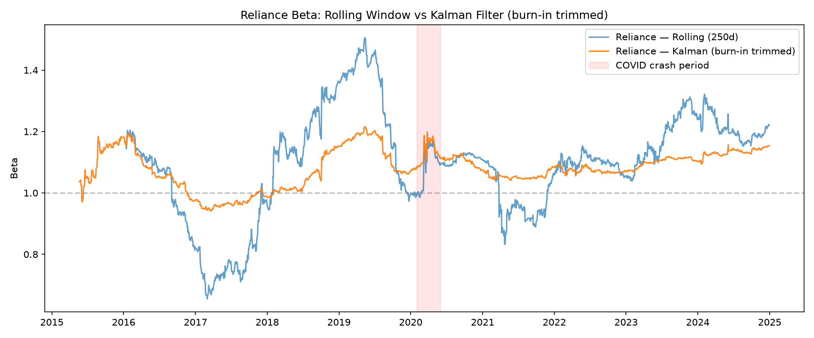

# Neural CAPM: Dynamic Beta Estimation

**Can neural networks learn time-varying systematic risk more accurately than classical rolling-window CAPM?**

This project builds toward a graph-temporal neural model that estimates CAPM beta as a time-varying, uncertainty-aware quantity conditioned on macroeconomic, fundamental, and market-relationship data — rather than assuming beta is a single constant, as classical CAPM does.

> **Status: Phase 1 (Classical Baselines) complete.** Neural modeling (Phase 2+) is in progress.

---

## Motivation

Classical CAPM assumes a stock's beta (systematic risk sensitivity) is fixed:

```
E(R_i) = R_f + β_i(E(R_m) − R_f)
```

In reality, beta drifts with macroeconomic conditions, volatility regimes, and company fundamentals — visibly so during events like COVID-19. This project:

1. **Proves this empirically** using classical adaptive estimators (rolling window, Kalman filter) against a static baseline.
2. **Builds a neural model** to predict beta as a function of macro/fundamental/technical features, with calibrated uncertainty (P(β), not just β).
3. **Extends to a graph-temporal model**, where a stock's beta depends not just on its own history but on its position in a company relationship network (sector, correlation structure) — the project's core research contribution.

Full technical rationale and phase-by-phase design decisions: [`docs/methodology.md`](docs/methodology.md).

---

## Phase 1 Results (Complete)

**Question:** Does a simple adaptive beta estimator produce measurably better return predictions than static CAPM beta, in real equity data?

**Universe:** 12 NIFTY 50 stocks across 6 sectors (RELIANCE, TCS, HDFCBANK, INFY, ICICIBANK, HINDUNILVR, ITC, LT, SBIN, BHARTIARTL, MARUTI, SUNPHARMA) vs. NIFTY 50 index, 2015–2024 (~2,457 trading days).

| Method | Beats Static CAPM (RMSE) | Statistically Significant (DM test, p<0.05) |
|---|---|---|
| Rolling-window beta (250d) | 7 / 12 stocks | — |
| **Kalman-filtered beta** | **12 / 12 stocks** | **6 / 12 stocks** (4 more at p<0.10) |

**Finding:** Kalman-filtered beta produced lower out-of-sample return prediction error than static beta on every stock tested, with the improvement statistically significant (Diebold-Mariano test) for half the universe and approaching significance for most of the rest. This is direct, real-data evidence that systematic risk is time-varying — and that a properly adaptive estimator can exploit this, motivating the neural extension in later phases.

Full results tables: [`results/tables/`](results/tables/) · Figures: [`results/figures/`](results/figures/) · Full writeup: [`docs/methodology.md`](docs/methodology.md)



---

## Phase 2 Finding (Complete)

An LSTM conditioned on macro, technical, and lagged-beta features was tested against a naive "no change" (persistence) baseline for predicting daily changes in Kalman-filtered beta, across the full 12-stock universe. **The LSTM did not beat persistence on any of the 12 stocks** (MSE ratios 1.3x–6.4x worse). This is explained by the Kalman filter's own state equation, which models beta's increments as return-driven noise with no mechanism for macro/technical features to influence it — meaning a univariate filter has already extracted nearly all learnable signal from its own inputs. This motivates Phase 4's specific hypothesis: that *cross-company* information (sector/correlation-based lead-lag effects), which a univariate filter structurally cannot see, is a more promising channel for a neural model to add real value. Full writeup: `docs/methodology.md`.

---


## Project Roadmap

- [x] **Phase 0** — Foundations, repo setup, environment
- [x] **Phase 1** — Classical baselines: static, rolling-window, and Kalman-filtered beta, with full statistical validation
- [x] **Phase 2** — Neural beta: LSTM/Transformer predicting β_t from macro + fundamental + technical features
- [ ] **Phase 3** — Uncertainty-aware beta: Bayesian Neural Network / MC-Dropout producing calibrated P(β)
- [ ] **Phase 4** — Graph-temporal beta: GNN + temporal model conditioning beta on company relationship structure (novel contribution)
- [ ] **Phase 5** — Portfolio construction, explainability (SHAP/Integrated Gradients), and final writeup

---

## Repository Structure

```
neural-capm/
├── src/neural_capm/
│   ├── data/            # loaders, macro/fundamental feature joins, graph construction
│   ├── finance/         # static / rolling / Kalman beta, Fama-French, portfolio math
│   ├── models/          # (Phase 2+) LSTM, Transformer, BNN, GNN beta predictors
│   ├── evaluation/      # metrics (RMSE, MAE, Diebold-Mariano), backtest engine
│   └── explainability/  # (Phase 5) SHAP, Integrated Gradients
├── notebooks/           # phase-by-phase exploration and analysis
├── scripts/             # data download, training, evaluation entrypoints
├── tests/               # pytest suite — every finance/data function is tested
├── data/raw/            # downloaded OHLCV data (gitignored, regenerable via script)
├── results/
│   ├── figures/         # generated plots
│   └── tables/          # generated comparison tables (CSV)
└── docs/
    └── methodology.md   # full technical writeup, phase by phase
```

---

## Setup

Requires **Python 3.12** (pinned in `pyproject.toml`).

```powershell
# clone and enter the repo
cd neural-capm

# create and activate a virtual environment
python -m venv venv
venv\Scripts\Activate.ps1        # PowerShell (Windows)
# source venv/bin/activate       # macOS/Linux

# install the package in editable mode
pip install --upgrade pip setuptools wheel
pip install -e .
```

**Every new terminal session**, just run:
```powershell
cd path\to\neural-capm
venv\Scripts\Activate.ps1
```

## Getting the Data

```powershell
python scripts\download_data.py
```

Downloads daily OHLCV for the 12-stock universe + NIFTY 50 index (2015–2024) into `data/raw/`. Safe to re-run at any time — it fully regenerates the raw dataset.

## Running Tests

```powershell
pytest tests/ -v
```

All finance and data-loading logic is covered by unit tests, including:
- Mathematical correctness checks (e.g. a series' beta against itself must equal exactly 1)
- No-lookahead guarantees for rolling and Kalman beta (verified via truncated-vs-full-sample comparison)
- Kalman filter convergence and regime-shift responsiveness
- Statistical test correctness (Diebold-Mariano, including edge cases)

Current status: **28/28 tests passing.**

## Reproducing Phase 1 Results

```powershell
jupyter notebook notebooks/02_baseline_capm.ipynb
```

Runs static, rolling, and Kalman beta across the full universe, generates the comparison and significance tables, and saves all figures to `results/`.

---

## Key Design Principles

- **No lookahead bias.** Every time-varying estimator is explicitly tested to guarantee beta at date *t* uses only data available up to and including *t*.
- **Statistical rigor over visual impression.** Every "method A beats method B" claim is backed by a significance test (Diebold-Mariano), not just a lower error number.
- **Reproducibility.** Pinned Python version, editable local install, deterministic data pipeline, all results regenerable from the raw data via committed scripts and notebooks.
- **Honest limitations, documented.** Known caveats (e.g. survivorship bias in the stock universe, static beta's built-in full-sample advantage in backtests) are stated explicitly in [`docs/methodology.md`](docs/methodology.md) rather than glossed over.

---

## Tech Stack

`pandas` · `numpy` · `statsmodels` · `scipy` · `yfinance` · `pytest` — classical stack for Phase 0–1. PyTorch, PyTorch Geometric, and Bayesian modeling libraries will be added for Phase 2 onward (see `docs/methodology.md` for the full planned stack).

---

## License

*(add your chosen license here — MIT is a common choice for research code)*